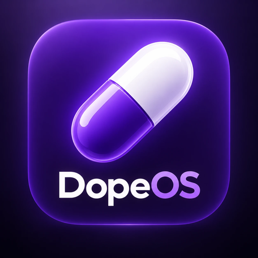

<div align="center">



# 💊 DopeOS

### O celular é o jogo. A sua atenção move o mundo.

*Welcome to a more fun version of the world.*

Um jogo mobile que transforma um sistema operacional fictício em uma experiência interativa sobre hábitos digitais, personagens e a economia da atenção.


[✨ Sobre o projeto](#sobre-o-projeto) · [📱 Funcionalidades](#principais-funcionalidades) · [🐛 Reportar problema](https://github.com/ncaraffa/DopeOS/issues)

</div>

---

## Sobre o projeto

O **DopeOS** é um jogo mobile 2D desenvolvido em Flutter em que **o celular é o próprio jogo**. Ao abrir o app, o jogador entra em um sistema operacional fictício: inicialização, tela de bloqueio, tela inicial, aplicativos, notificações e multitarefa fazem parte da experiência.

Dentro desse mundo, você navega por um feed de vídeos, conversa com personagens, personaliza seu aparelho e participa de uma economia virtual. Um algoritmo adaptativo observa suas ações dentro do jogo e ajusta o conteúdo, as notificações e as recompensas.

Toda essa interface existe dentro do aplicativo. O DopeOS não substitui o sistema operacional do aparelho.

## Propósito

Criar uma experiência divertida e imersiva que explore **como aplicativos disputam a nossa atenção**. O jogador interage com mecanismos familiares — rolagem infinita, notificações, recompensas e relações digitais — e acompanha como eles influenciam seus hábitos dentro de um mundo simulado.

A proposta combina a sensação de usar um celular completo com personagens que têm histórias e rotinas próprias. O sistema aprende com o jogador, enquanto o jogador descobre como o sistema funciona.

## Principais funcionalidades

- **Sistema operacional fictício:** boot, bloqueio, home, pastas, widgets, notificações e alternância entre apps.
- **Loop:** rede social de vídeos curtos com reprodução de vídeos reais, curtidas, comentários, perfis, busca e publicação a partir da galeria.
- **Chat:** conversas com personagens, contexto, memória e personalidades próprias, com IA em nuvem opcional e respostas locais de fallback.
- **Vida dos personagens:** rotinas, atividades, disponibilidade e acontecimentos que dão continuidade às conversas.
- **Algoritmo adaptativo:** conteúdo e estímulos ajustados às interações do jogador dentro do DopeOS.
- **Economia virtual:** saldo, recompensas, lojas e colecionáveis integrados à progressão.
- **Personalização:** estilos visuais, wallpapers, avatares e organização da tela inicial.
- **Screen Time:** acompanhamento do uso dentro do jogo e descoberta do que o algoritmo aprendeu.
- **Progresso salvo:** persistência local para continuar a experiência.

> A economia utiliza apenas dinheiro virtual. Não há depósitos, saques ou apostas com dinheiro real.

## Como a experiência funciona

1. Entre no celular fictício e explore seus aplicativos.
2. Assista a vídeos, converse, personalize e avance na progressão.
3. O algoritmo adapta o mundo às suas interações.
4. Os personagens seguem suas rotinas e histórias.
5. Observe seus hábitos e a disputa pela sua atenção dentro do jogo.

## Tecnologias utilizadas

| Tecnologia | Função no aplicativo |
|---|---|
| **Flutter + Dart** | Interface, animações e lógica do jogo |
| **Riverpod** | Gerenciamento de estado |
| **Hive CE** | Persistência local |
| **Players de vídeo** | Reprodução de MP4 e fontes locais/remotas no Loop |
| **Firebase AI Logic + Gemini** | IA em nuvem opcional para o Chat |
| **Sistemas locais de simulação** | Comportamento adaptativo, memória, rotinas e economia |

O desenvolvimento tem foco em Android. A base Flutter também contempla iOS; disponibilidade pública e suporte final serão informados quando houver uma versão distribuída.

## Dados e conectividade

O progresso e os sistemas de simulação são armazenados localmente. Recursos de vídeo remoto dependem de conexão; o Chat pode usar IA em nuvem quando habilitada, com fallback local quando ela não estiver disponível.

Não há integração pública anunciada com APIs do TikTok ou Instagram. O Loop é uma rede social fictícia própria do DopeOS.

## Identidade visual

A **cápsula roxa e branca** é a logo oficial do DopeOS. A identidade combina roxo, branco e uma atmosfera digital própria, presente na marca e na experiência do aplicativo.

A imagem original está em [`assets/brand/dopeos_logo.png`](assets/brand/dopeos_logo.png).

## Estrutura deste repositório

```text
README.md                   apresentação e propósito do projeto
assets/
└── brand/
    └── dopeos_logo.png      logo oficial do DopeOS
```

Este é o repositório público de apresentação do projeto. O código-fonte do aplicativo não está incluído aqui.

## Status

O **DopeOS está em desenvolvimento ativo**. Esta página apresenta o conceito e os sistemas do projeto; funcionalidades e disponibilidade podem evoluir durante o desenvolvimento.

Ainda não há link público de download neste repositório. Quando houver uma versão pública, as instruções serão adicionadas aqui.

## Contato

- GitHub: [@ncaraffa](https://github.com/ncaraffa)
- Sugestões e problemas: [Issues do DopeOS](https://github.com/ncaraffa/DopeOS/issues)

---

<div align="center">

Desenvolvido por **Nicolas Caraffa**. 💜

*Welcome to a more fun version of the world.*

</div>